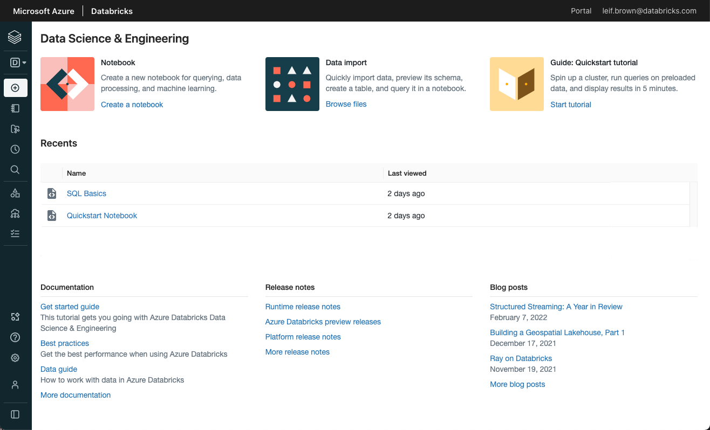

# Data Analysis Workshop with Azure Databricks
##### Denmark Technical University, Copenhagen - March 2022
## Overview

This workshop content helps one get started on data engineering and data science by showing hands-on - how to use a sample dataset 
to spot patterns and answer important business questions

In this workshop, we will use a dataset about "E-Commerce Data" from [Kaggle](https://www.kaggle.com/benroshan/ecommerce-data), perform data analysis on it using Python 
using Databricks Platform on Azure.


[Databricks](https://databricks.com/) is a comprehensive data analytics platform optimized for developing data intensive applications: 
Data Science & Engineering, and Machine Learning.  It supports Python, Scala, R and SQL 


## Prerequisites
- Laptop with WiFi
- Microsoft Azure Free Account 

## Agenda
- Environment setup - Gaya
- Data cleaning and preparation - Febiyan
- Data Analysis - Min
- Data Visualization - Samia

## Environment setup
- Log in to [Microsoft Azure](https://portal.azure.com)
- Create Azure subscriptions and Resource groups and launch Azure Databricks service to get started on data analysis
- Learn more about azure on [Microsoft website](https://docs.microsoft.com/en-us/learn/modules/intro-to-azure-fundamentals/)
 
- For this workshop, we have a Databricks instance already setup - visit [this link](https://adb-6133228101285352.12.azuredatabricks.net/?o=6133228101285352#)  
 using login credentials below


``` md
username - dtuworkshop@outlook.com
password - see whiteboard/screen
```
   
### Databricks Workspace View

  
                
- In the workspace menu, create a sub-folder under `/Shared/` folder with naming convention `<firstname_lastname>`. 
- This is where each of us creates the code we write during the workshop
- Write simple code (Python, SQL etc) to play with the data, using the compute resources to execute data related processing
- For this exercise,  we have some clusters already configured  - 
``` dtu_group_1, dtu_group_2```

## Data engineering - Cleaning and Preparation

See [dtu_data_engineering.ipynb](dtu_data_engineering.ipynb)

## Data Analytics 
<answer questions - lines of code> 


