# How to create free azure databricks account

## URL to start

- Crate free account with azure databricks: https://azure.microsoft.com/en-us/free/databricks/
  
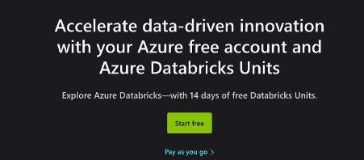

eg. 
```text
pandora.dtu@gmail.com
<HiddenSecret>@dtu@0309
  ```

```html
If you do not have an account with microsoft yet, you can create one using any email address. e.g.
dtuworkshop@outlook.com
```

- Fill in profile details
```text
Note: Phone number might be tied to your (free) subscription, and prevent you from creating multiple free subscriptions.
```

- Verify by phone number

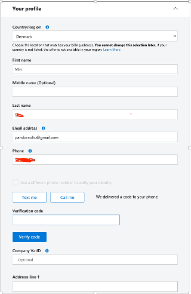

- "Next" then verify by create card (without actual charge)

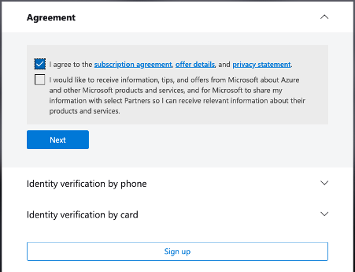

- Verify by credit card (without actual charge)

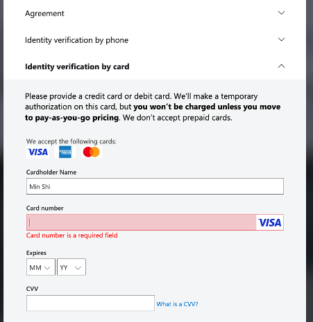

- Sign up

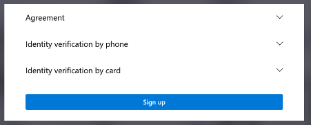

- Welcome to Azure

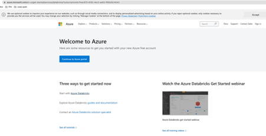

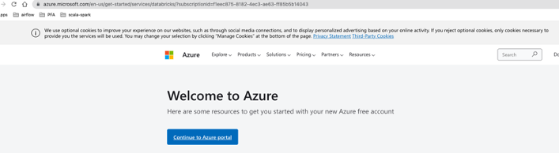

- Continue to Azure portal

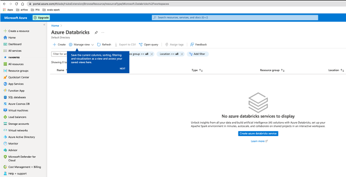

- Create azure databricks service

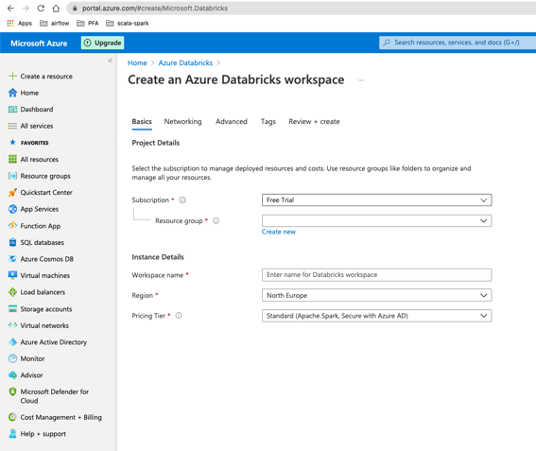

- Create an azure databricks workspace


- Review and create

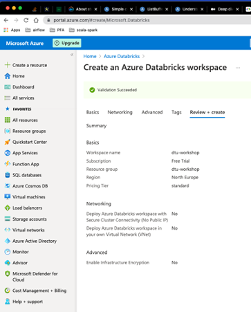

- Created and ready for 'go to resource' 

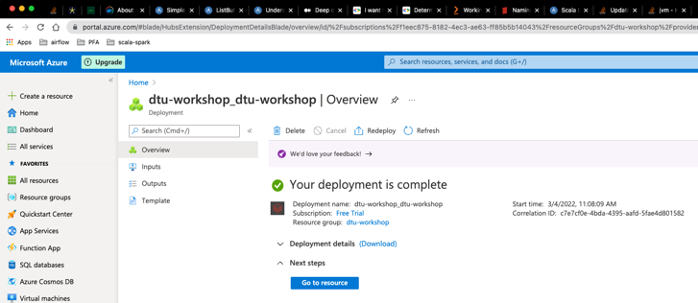

- Launch workspace

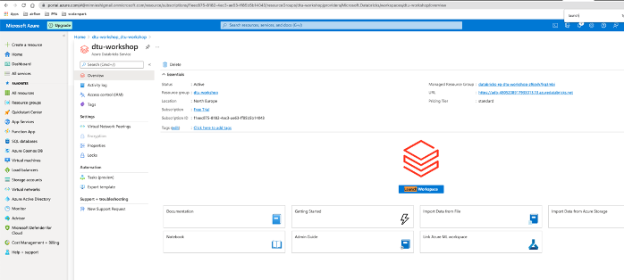

## Other options:
- Use student offer, if the school has account


- Another approach for create free azure databricks account
  - login to Microsoft, Then create subscription
    
    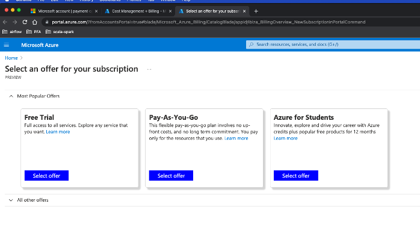
  
## clean up account
- Delete subscription
```
The subscription can only be deleted 3 days after it is canceled. 
Before you delete your subscription make sure you don’t have any active resources. 
```
- How to remove account:

https://blog.trustedtechteam.com/2020-12-22-is-breaking-up-with-azure-hard-to-do-how-to-delete-your-azure-account/
